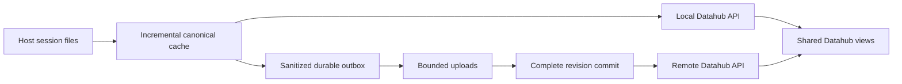

# Shared local and remote Datahub read flow

Status: the shared Datahub uses the live Worker adapter over committed control-plane
state. Frozen website exports are no longer supported. Deployment and verification
are documented in [operations](refactor/operations.md). The
[complete refactor specification](refactor/README.md) governs the remaining work;
this document summarizes the consumer boundary so upload and presentation can
evolve independently.

## Architecture decisions

Keep one domain model and one set of query semantics with two storage adapters.
Local and shared views may differ in freshness and available evidence, but must
not assign different meanings to the same canonical fields.

| Layer | Owns | Does not own |
| --- | --- | --- |
| Host ingestion | Source fencing, parsing, canonical resource identity, measurements, discovery checkpoints | Browser presentation or network delivery |
| Host canonical store | Versioned queryable local resources and indexes, shared by local readers and synchronization | Deciding whether a remote upload succeeded |
| Synchronization | Sanitization, durable outbox, immutable batches, acknowledgements, publication mode | Reinterpreting canonical measurements |
| Shared storage | Committed manifests, resource versions, ownership, private immutable payloads, published revision | Parsing host log files or serving staged data as current |
| Query adapters | Canonical query contracts, bounded indexed reads, capabilities, revision selection | Triggering uploads as a read side effect |
| Datahub | Navigation, presentation, lazy detail loading, source and freshness indicators | Inferring missing data or carrying collector credentials |

The host canonical store is a target consolidation of existing discovery,
DocumentStore, and living projection/cache facilities. It is not a claim that a
single durable incremental canonical database already exists. Shared metadata
uses the current workspace SQLite Durable Object; immutable canonical payloads
use private R2. Replace generic whole-collection scans with indexed, paginated
queries as the live reader is introduced. Adding a second remote database is not
required for the initial integration.

Local source means the selected host's local authority. Shared source means the
authorized workspace's published data across collector hosts. Source selection
is a query boundary, independent of where the browser runs. Do not silently merge
local and shared rows: explicit federation would need separate identity,
deduplication, ownership, and freshness rules.

Remote-only readers consume the published shareable representation. Full raw
evidence stays on the originating host. Identical user experience means common
navigation, query semantics, and honest availability, not claiming identical
evidence coverage.

## Three kinds of incrementality

| Capability | Current evidence | Required direction |
| --- | --- | --- |
| Incremental discovery | Source inventory/checkpoint code identifies changed files; living APIs expose resource deltas | Reuse that work across consumers |
| Incremental canonical construction | Affected graphs are still reconstructed from source prefixes | Persist reusable canonical resources and parser checkpoints where adapter semantics permit; qualify equivalence with full reconstruction |
| Incremental transfer | Chunk upload implementation is in progress | Send only changed bounded nodes, retain unchanged references, and commit a complete revision |

Chunk transfer can improve bandwidth before construction becomes incremental.
Do not report that as a parser CPU improvement. Completed turns can still receive
corrections, source files can rotate or truncate, and schema changes can require
reconstruction. Use explicit source epochs and bounded reconciliation rather than
assuming every input is permanently append-only.

## Responsibilities

Each collector host owns source discovery, canonical construction, privacy
filtering, and its durable upload outbox. Local Datahub reads the same underlying
canonical cache. Viewing a session does not trigger remote publication.

The upload service persists changes immediately, batches bounded resource
updates, and publishes a complete revision after its referenced payloads are
durable. Manual mode waits for an explicit publication request; automatic mode
flushes according to configured limits. A crash must not change the selected mode.

Datahub owns query adaptation, capability presentation, pagination, lazy detail
loading, and freshness display. It never interprets staging completion as a
published revision or recalculates canonical measurements differently by source.

## Query boundary

Use the existing `ct.datahub.v1` envelope at `POST /api/datahub/query` for both
adapters. Core and Datahub remain separate contract namespaces. Reuse the current
method inventory in `datahub_plugin/serving/routes.py`; do not introduce another
parallel set of browser routes for live remote data.

| Operation | Required behavior |
| --- | --- |
| `datahub.capabilities` | Advertise actual supported methods and field availability. Remote live data must not be mistaken for local full-evidence access. |
| `datahub.snapshot` | Return the latest committed publication revision, bootstrap coverage, source identity, and freshness. This is a read snapshot, not a website export. |
| `datahub.changes` | Return bounded changes since a published revision, or an explicit reset requirement if it is no longer retained. |
| `projects`, `sessions` | Read indexed metadata and small projections; never hydrate the entire workspace to list sessions. |
| `session.graph`, `session.tree` | Fetch the requested graph's committed manifest and required projections lazily. |
| `session.items` | Page bounded metadata for requested resources. Content remains subject to the existing local-evidence boundary. |

One browsing operation pins a revision for consistent pagination and graph/detail
joins. A refresh may select a newer revision; it must not combine pages from
different revisions. Bind caches and cursors to source, workspace, revision,
method, filters, and projection version. A source switch invalidates incompatible
cached data.

The live adapter covers the currently shareable session/graph views. Other
analysis methods become available only after remote contract parity
is qualified. Unsupported methods report the established availability envelope,
rather than invented empty results or local fallback on a remote host.

## Required upload-to-read interface

The upload implementation must provide these semantics; exact internal method
names are owned by the implementation agent:

1. A cheap published-revision lookup. Upload attempts, staging writes, estimator
   jobs, and heartbeats must not independently imply changed historical data.
2. Resource-scoped lookup of committed manifests, their immutable content hashes,
   canonical schema version, and projection version.
3. Visibility only after all required parts exist and validation succeeds. A
   reader may see the old revision during upload, never a mixture of old and new.
4. A bounded change feed containing affected resource identities and explicit
   historical deletions. Leaving the living inventory is not a historical delete.
5. Revision retention sufficient for active cursors, with an explicit expiration
   response and safe resnapshot behavior. Never silently substitute the latest
   revision for an expired requested revision.
6. Provenance that identifies the owning collector and source epoch without
   exposing host paths, credentials, or raw session bodies.

The committed authority exposes indexed publication catalog and change methods
for the live Datahub adapter. Manifest-native chunk reads remain under
qualification and do not expose a second browser protocol.
Legacy gzip artifacts remain a compatibility case; the existing size ceiling
must not be bypassed by unbounded reconstruction. Chunking alone does not yet
establish support for sessions beyond that ceiling.

No browser-held collector credentials or direct private object-store access is
required. The authenticated server adapter resolves permitted workspace data.
Canonical projection values come from the same verified construction used
locally; browser adapters handle presentation, not alternative metric formulas.

## Freshness and recovery presentation

Keep three facts separate:

- Session state: the last observed active/completed state and its observation time.
- Synchronization state: pending, uploading, retrying, paused/manual, or caught up,
  when that state has actually been reported by the owning host.
- Published state: the revision and timestamp available to remote readers.

An unreachable host has unknown current synchronization state. It does not have
an empty outbox by inference. An expired heartbeat does not prove that a session
finished. The remote UI can continue showing the last committed data with its
age while the host resumes delivery.

Manual publication naturally produces older remote data while local views keep
advancing. Present that as a publication mode and timestamp, not a service error.

## Integration sequence and acceptance

1. Maintain the manifest, published watermark, and scoped-read interface between
   the upload authority and live reader.
2. Keep the database-backed Datahub adapter under the current query envelope;
   do not reintroduce a website-export delivery path.
3. Qualify local and shared responses from the same sanitized corpus: identity,
   graph relationships, measurements, pagination, and availability must agree.
4. Verify that partial uploads are invisible, lost acknowledgements create no
   duplicate revisions, source switches isolate caches, and expired cursors reset
   explicitly. Use integration qualification, not new unit tests.
5. Promote hosted releases only after authenticated live reads and multi-host
   upload/recovery checks pass. Data publication must remain visible without a
   website rebuild or software deployment.

The existing five-minute upload LaunchAgent on this Mac was disabled at the
user's request. Neither read integration nor service installation should silently
re-enable automatic publication.
