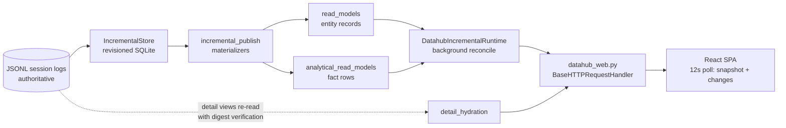

# Datahub Plugin Redesign — UI + Architecture

- **Status**: Draft
- **Date**: 2026-09-01
- **Scope**: `packages/plugins/datahub` (Python backend + React web UI)
- **Direction**: Refined evolution — keep the dark/neutral + teal identity, make it cleaner, denser, and more consistent. Not a rebrand, not a maximal-density ops console.

## Overview

The datahub plugin has outgrown its current shape on both sides of the wire. The Python backend is 23 flat modules (~15.7k lines) with several god modules, three overlapping model layers, and a hand-rolled HTTP layer. The web UI is functionally rich but wastes space (marketing-style hero cards on every route, narrow content column), breaks on mobile (horizontally overflowing tables), and ships hand-maintained TypeScript mirrors of Python payloads that drift.

This document proposes a staged redesign: (A) refresh the visual language at the token tier, (B) rebuild the layout and information architecture around data density, (C) restructure the Python package into layered subpackages with split god modules, and (D) align the API contract by generating TypeScript types from the Pydantic models. Each stage lands as an independently mergeable PR with the app working at every step.

## Background & Motivation

### Current data flow



### Backend audit findings

- **God modules**: `incremental_store.py` (2,307 lines, one `IncrementalStore` class with ~60 methods spanning refresh planning, ingestion, entity mutation, change logging, cursors, detail rows, and schema DDL), `incremental_runtime.py` (1,617 lines mixing route-facing read APIs, bootstrap, materialization orchestration, and a monitor loop), `token_efficiency.py` (1,441), `read_models.py` (1,211), `context_window.py` (1,178).
- **Three overlapping model layers**: `read_models.py` payload models, `analytical_read_models.py` fact rows, and `incremental_store_models.py` store contracts. Splitting is inconsistent: `context_window_models.py`, `token_efficiency_models.py`, `incremental_store_models.py` exist, but `model_usage.py` and `session_timeline.py` inline theirs.
- **Flat module soup**: 23 top-level modules, no subpackage boundaries between store, projections, serving, CLI, and maintenance concerns.
- **Dual-import fallback noise**: every module carries `try: from .x import ... / except ImportError: from x import ...` to support both package and loose-script imports.
- **Hand-rolled HTTP layer**: `datahub_web.py` is one `BaseHTTPRequestHandler` subclass with a ~130-line if/elif route chain (20 API routes), plus static file serving and gzip in the same class.
- **Contract drift**: `web/src/api.ts` is 1,143 lines of hand-written TypeScript mirroring Python payload shapes with no mechanical check.
- **Stringly-typed delivery coupling**: backend "delivery families" (`_delivery_families()` in `incremental_publish.py`) must match frontend query-key strings in `web/src/hooks/use-datahub-delivery.tsx` (`QUERY_FAMILIES`) by convention only.

### UI audit findings (verified in browser, dark + light + mobile)

- Every route opens with a hero card (eyebrow + multi-line display headline, e.g. "Where did tokens, time, and money go?") consuming ~200px of vertical space before any data.
- The route container (`--container-route: 96rem`) plus sidebar leaves large dead areas on wide screens; the sessions table renders far narrower than the available width.
- Mobile (390px): the sessions table overflows horizontally; VENDORS/TITLE columns are clipped with no card-list fallback.
- Hardcoded vendor-specific copy: `turnGroupLabel()` in `web/src/routes/context-window.tsx:84-88` returns `"Claude works"` regardless of vendor — visible inside pi-vendor sessions.
- Breadcrumb shows "Sessions › Today" although Today is a top-level route.
- Stray bar artifact inside the Runtime metric card on `/today`.
- Oversized metric cards (one number + caption in a large padded card); sparse monochrome-teal charts.

### What is solid and must be preserved

- `IncrementalStore` core semantics: revisioned SQLite, prefix/tail checksums, metadata-driven reconciliation, unchanged sources never re-parsed, single-transaction refresh, bounded change log.
- `detail_hydration.py`: bounded re-read of authoritative JSONL with checkpoint-fence and per-record digest verification before serving detail content.
- Strict Pydantic boundary models (`extra="forbid"`).
- The three-tier token architecture in `styles.css` (primitive palette → semantic tokens → Tailwind utilities via `@theme inline`) — the visual refresh edits tiers 1–2 only.
- Frontend stack: TanStack Query/Router, shadcn/ui components, code-split routes.

## Goals & Non-Goals

### Goals

1. **G1 — Visual refresh (refined evolution)**: tighter type scale, refined neutral + teal palette, reduced radius, higher density; implemented at token tiers 1–2 of `styles.css`.
2. **G2 — Layout & IA**: compact page-header pattern replaces hero cards; sidebar grouped by task (Observe / Analyze); route-appropriate container widths; responsive table → card-list strategy; fix the verified copy/artifact bugs.
3. **G3 — Backend structure**: subpackage layout (`store/`, `projections/`, `http/`, `cli/`, `maintenance/`); split god modules along existing private-method seams; remove dual-import fallbacks; no behavior change.
4. **G4 — Contract alignment**: TypeScript types generated from Pydantic models; hand-written API client shrinks to fetch functions only.
5. **G5 — Verified rollout**: every PR passes the metrics quality gate where it touches metric-sensitive paths, and every UI PR is verified in a browser (chrome-devtools) across routes, themes, and viewports.

### Non-Goals

- Changing `IncrementalStore` storage semantics, schema, or the JSONL-authoritative model.
- Replacing the frontend stack (TanStack, shadcn/ui, Tailwind v4, ApexCharts all stay).
- Real-time push (SSE/WebSocket) — the 12s poll stays; see Open Questions.
- Authentication/multi-user — the server remains a localhost single-user tool.
- New analytics features; this is a redesign of what exists.
- Unit tests (project rule: do not write them).

## Proposed Design

### Part A — Visual language (token-tier refresh)

All changes land in `styles.css` tiers 1 (primitive palette) and 2 (semantic roles). Components continue to reference tier-3 utilities, so the re-skin propagates without touching component code.

**Palette.** Keep the neutral zinc-like scale and teal accent; refine rather than replace:

| Token | Light (now → proposed) | Dark (now → proposed) |
|---|---|---|
| `--accent-teal` | `#0f766e` → `#0d7377` (slightly deeper, less green) | `#2dd4bf` → `#2dd4bf` (unchanged) |
| `--paper` | `#fafafa` → `#f7f7f6` (warmer neutral) | `#0a0a0a` → `#0b0b0c` (hint of blue) |
| `--paper-strong` | `#ffffff` (unchanged) | `#171717` → `#141416` |
| `--line` | `#e5e5e5` → `#e7e7e4` | `#262626` → `#232326` |
| `--ring` | `#a3a3a3` → `var(--accent-teal)` (focus = accent, not gray) | `#525252` → `var(--accent-teal)` |

Chart palette keeps 6 categorical colors but raises dark-theme lightness spread so adjacent series are distinguishable; the category colors (`--color-category-*`) are untouched (they carry meaning in the context window).

**Typography.** Keep Inter for both display and body (a new font would cross into rebrand territory). Tighten the scale:

- `--text-display`: `clamp(1.875rem, 3vw, 2.5rem)` → `1.375rem` (page titles only; hero headlines are deleted in Part B).
- `--text-h1`: `1.5rem` → `1.25rem`; `--text-heading`: `1.25rem` → `1.0625rem`.
- `--text-metric`: `1.875rem` → `1.5rem`, always with `font-variant-numeric: tabular-nums` (promote `.mono` numeral behavior into metric tiles).
- Add `--text-micro: 0.6875rem` for dense table metadata, replacing ad-hoc `text-[11px]` usages.

**Density & shape.**

- `--radius`: `0.75rem` → `0.5rem` (crisper cards; `rounded-3xl` heroes disappear with the hero pattern anyway).
- `--pad-panel`: `0.75rem` (keep), but metric cards stop using panel padding — see the stat-tile pattern below.
- Shadows stay subtle; `--shadow-md` becomes the default card shadow in dark theme only (light theme uses borders alone).

### Part B — Layout & information architecture

**B1. PageHeader replaces hero cards.** A single `PageHeader` component used by every route:

```tsx
<PageHeader
  eyebrow="Usage"                       // optional, small caps, muted
  title="Compare"                       // text-h1, semibold
  description="Where tokens, time, and money went."  // optional, one line
  actions={<DateRangePicker … />}       // right-aligned, inline
/>
```

Total height ≈ 64px versus ~200px today. The editorial headline copy ("Conversation branches and their owned agent runs.") is replaced by functional titles; color comes from data, not typography.

**B2. Sidebar grouping.** Regroup `app-sidebar.tsx` nav by task:

- **Observe**: Sessions, Today
- **Analyze**: Compare, Code Time

Breadcrumbs derive from the sidebar group, not a hardcoded "Sessions" root — fixing the "Sessions › Today" bug. The sidebar header keeps the CT mark + "CodingTrajectory" but drops the "Session observability" strapline into a tooltip.

**B3. Container strategy.** Two route container widths instead of one:

- `.route-container` (dashboard routes: Today, Compare, Code Time) keeps `max-width: 96rem`.
- `.route-container-wide` (table/explorer routes: Sessions, session workspace) uses `max-width: none` with the existing padding clamp, so tables use the full inset width.

**B4. Responsive tables.** Add a `ResponsiveDataList` wrapper: ≥48rem renders the existing `DataTable`; <48rem renders a card list generated from column definitions (each column declares a `mobilePriority`; priority 1–2 fields show in the card). Applied first to the sessions table (the verified overflow), then to code-time and forecast tables.

**B5. Stat tiles.** Replace the padded metric card with a compact stat tile: label (eyebrow-soft), value (`--text-metric`, tabular nums), one-line caption; `p-3`, `gap-2`, four-up grid collapsing 4→2→1 as today. Fixes the Runtime card bar artifact by moving sparkline/progress out of the tile into an explicit `StatTile.Footer` slot that only renders when provided.

**B6. Verified bug fixes** (land in the first PR, ahead of the visual work):

1. `turnGroupLabel()` in `context-window.tsx` — make vendor-aware (`{Vendor} works` from the session vendor, fallback "Agent activity").
2. Runtime metric card artifact on `/today`.
3. Breadcrumb root per sidebar section (B2).

### Part C — Backend package restructure

Target layout (moves only in the first backend PR; splits in the second):

```
packages/plugins/datahub/
  __init__.py                 # package marker; no dual-import fallbacks anywhere
  __main__.py                 # `python -m datahub` entry
  cli/
    __init__.py               # argparse root (current datahub.py)
    cleanup_cmd.py            # project/session cleanup commands
    code_time_cmd.py          # code-time + forecast commands
    context_window_cmd.py
  store/
    __init__.py               # re-exports IncrementalStore, MaterializationContext
    models.py                 # ← incremental_store_models.py
    core.py                   # IncrementalStore: lifecycle, refresh(), commit
    ingestion.py              # plans, classify, parse, message upserts
    entities.py               # entity mutation/query, cursors
    changes.py                # change log, prune, snapshot/changes payloads
    detail.py                 # detail rows (detail_events/detail_items)
  projections/
    __init__.py
    read_models.py
    analytical.py             # ← analytical_read_models.py
    model_usage.py
    token_efficiency.py
    token_efficiency_models.py
    session_timeline.py
    detail_hydration.py
    stat_utils.py
    context_window/
      __init__.py             # ← context_window.py (assembly)
      compact.py              # ← context_window_compact.py
      models.py               # ← context_window_models.py
      render.py               # ← context_window_render.py
      tools.py                # ← context_window_tools.py
  runtime/
    __init__.py               # DatahubIncrementalRuntime facade
    runtime.py                # route-facing read APIs (overview/today/sessions/…)
    materialize.py            # ← incremental_publish.py + bootstrap/incremental orchestration
    monitor.py                # monitor loop, obsolete-DB retirement
  http/
    __init__.py
    server.py                 # handler class, static serving, gzip
    routes.py                 # declarative route table (Part D)
  maintenance/
    __init__.py
    cleanup.py
    cleanup_metadata.py
    codex_app_server.py       # compat re-export (unchanged)
  web/                        # frontend (unchanged location)
```

Rules for the restructure:

- **Plugin-rooted absolute imports only.** All `try/except ImportError` fallbacks are deleted. Verified execution model: the plugin host (`packages/cli/src/coding_trajectory_cli/plugins.py:run_plugin`) runs the entry as a loose script — `subprocess.run([sys.executable, entry_path, ...], cwd=plugin_dir)` — and nothing imports the plugin as a package (no build-system in its `pyproject.toml`; it is a uv workspace member for dependency resolution only). Since the plugin dir is on `sys.path` in that model, internal imports become single absolute imports rooted at the plugin dir (`from store.models import ...`, `import projections.read_models`). The relative-import half of every fallback is dead code; the loose-script half is the only live path. `plugin.toml` keeps `entry = "datahub.py"`, now a thin shim delegating to `cli/__init__.py:main`.
- **Splits follow existing seams.** `IncrementalStore` splits by its current private-method clusters (ingestion plan/commit vs. entity mutation vs. change log); the public class remains as a facade subclass composing the parts so callers (`incremental_runtime`, tests-by-usage in scripts) don't change.
- **No behavior change.** Same SQL DDL, same revision semantics, same payloads. `scripts/check-metrics-quality-gate.sh` and `uv run python scripts/validate-metrics-baselines.py` must pass before each commit touching projections or runtime.

### Part D — HTTP layer

Replace the if/elif chain in `datahub_web.py` with a declarative table:

```python
@dataclass(frozen=True, slots=True)
class Route:
    method: str                       # "GET" | "POST"
    pattern: str                      # "/api/sessions/context-window"
    handler: str                      # runtime method name
    query: tuple[str, ...] = ()       # allowed query params (validated)

ROUTES: tuple[Route, ...] = (
    Route("GET", "/api/overview", "overview", query=("sinceDays",)),
    Route("GET", "/api/sessions", "sessions", query=("pageSize", "cursor", "projectName")),
    Route("POST", "/api/refresh", "request_refresh"),
    ...
)
```

The handler class keeps static serving and gzip but delegates dispatch to a matcher built once from `ROUTES`. This is a pure refactor of `http/server.py`; the wire format is unchanged, so the frontend needs no coordinated change.

### Part E — Contract alignment (Pydantic → TypeScript)

**Mechanism.** A script `scripts/generate-datahub-api-types.py`:

1. Imports the route payload models (`read_models`, `session_timeline`, `token_efficiency_models`, `incremental_store_models` response shapes).
2. Emits JSON Schema via `pydantic.TypeAdapter(...).json_schema()` into `web/src/api/schema/`.
3. Runs `json-schema-to-typescript` (devDependency) to emit `web/src/api/generated/types.ts`.
4. `web/src/api.ts` shrinks to fetch functions returning the generated types; hand-written payload interfaces are deleted.

A `bun run generate:api` script wires steps 1–3; CI/manual check is `git diff --exit-code` on the generated file after regeneration (no unit tests per project rule).

**Delivery contract.** The `QUERY_FAMILIES` mapping in `use-datahub-delivery.tsx` stays frontend-owned (it knows query keys) but the family list is generated from the same schema pass (families enum exported from `_delivery_families()`), turning a string convention into a checked import.

### Part F — Frontend component cleanup

- `main.tsx`: collapse the 5 legacy redirect routes (`/sessions/$id/graph|timeline|tree|context-window`, `/model-usage`) into a single data-driven legacy-redirect table; keeps URLs working, removes route-churn boilerplate.
- `api.ts`: see Part E.
- Delete dead exports surfaced by the restructure (e.g. anything only referenced by the removed hero pattern).

## API / Interface Changes

- **HTTP wire format: unchanged.** All redesign PRs keep `/api/*` payloads byte-compatible. Part E changes how the TypeScript types are produced, not their content.
- **Python internal imports: changed** (subpackage moves). The public plugin entry (`datahub.py:main`, `datahub_web.py:main`) is preserved via shims.
- **URLs: unchanged**; legacy redirects remain.

## Data Model Changes

None. The SQLite store remains disposable derived state with a format marker (`store_format_version`); JSONL logs remain authoritative. If any PR accidentally changes derived output, the metrics quality gate and baseline validation catch it; recovery is deleting the derived DB and letting bootstrap rebuild it.

## Alternatives Considered

1. **Full visual rebrand (new fonts, new accent hue).** Rejected by user direction ("refined evolution"); also higher regression surface for zero functional gain.
2. **Maximal-density ops console (Grafana-style).** Rejected by user direction; would hurt the session-explorer reading experience which benefits from comfortable line lengths.
3. **FastAPI/aiohttp instead of stdlib HTTP.** Rejected: adds a dependency and async rewrite for a localhost tool whose current server is not a bottleneck; the declarative route table gets 90% of the maintainability win.
4. **OpenAPI codegen instead of Pydantic → JSON Schema → TS.** Rejected: requires authoring/serving an OpenAPI document (a second contract description); the Pydantic models are already the authoritative shapes, so direct schema emission is less machinery.
5. **Move the whole UI to server-rendered pages.** Rejected: the existing TanStack Query delivery (revision polling, incremental invalidation) is well-suited to a live-updating local dashboard; a rewrite discards working machinery.

## Security & Privacy Considerations

- The server binds to `127.0.0.1` by default and has no auth — unchanged, appropriate for a single-user local tool. The redesign must not widen the default bind or add endpoints that write outside the derived store.
- Cleanup commands (`project cleanup`, `session cleanup`) remain CLI-only; no HTTP mutation endpoints are added.
- Generated TypeScript contains types only — no data leaves the machine.

## Observability

- Existing surfaces are preserved: `/api/datahub/snapshot` (revision, freshness, source status), `/api/datahub/changes`, runtime failure listing (`IncrementalStore.failures`).
- The redesign adds one log line per HTTP dispatch at DEBUG level (route id + duration), useful when verifying the route-table refactor.
- Metrics quality gate (`scripts/check-metrics-quality-gate.sh`) and baseline validation (`scripts/validate-metrics-baselines.py`) remain the quantitative safety net for Parts C–E.

## Rollout Plan

- PRs land in the order listed below; each is independently mergeable with the app fully working.
- UI PRs are verified in a browser (chrome-devtools MCP): every changed route, both themes, desktop + 390px mobile, including empty/error states.
- Backend PRs run the metrics quality gate before commit; the web server is smoke-tested end-to-end after each structural PR.
- Rollback: every PR is revertible independently; the derived SQLite store can be deleted and rebuilt from JSONL at any time.

## Risks

| Risk | Severity | Mitigation |
|---|---|---|
| Import-cycle regressions during subpackage moves | Major | Move-only PR first (no splits); `uv run` smoke of every CLI command + web server before commit |
| Metric drift from projection moves | Major | Quality gate + baseline validation before each commit; byte-compare `/api/*` responses pre/post move on the same store |
| Token refresh causes unintended visual regressions on un-audited components | Minor | Browser verification across all routes in both themes; tier-1/2-only edits constrain blast radius |
| Schema codegen produces unstable diffs (ordering) | Minor | Sort keys in emitted schema; pin `json-schema-to-typescript` version in `package.json` |
| Dual-import fallback removal breaks the loose-script execution model | Major | Verified: `run_plugin` executes `sys.executable datahub.py` with `cwd` = plugin dir, so plugin-rooted absolute imports resolve; smoke every `ct plugin datahub …` command + web server before commit |

## Open Questions

1. **Keep 12s polling or move to SSE?** The `/api/datahub/changes` poll is simple and works; SSE would cut latency for live sessions but adds connection lifecycle complexity to the stdlib server. Recommendation: keep polling in this redesign, revisit separately.
2. **Display font.** Inter everywhere is the refined-evolution default. If a stronger identity is wanted later, a single `--font-display` swap (e.g. a grotesk) is a one-token change.
3. **Retire legacy redirect routes?** They cost little; removal is a product call depending on whether old links are bookmarked anywhere.

## Key Decisions

1. **Token-tier re-skin instead of component rewrites** — the existing three-tier token architecture makes the visual refresh a `styles.css` change with near-zero component churn.
2. **Hero cards replaced by a single PageHeader pattern** — the biggest density win; editorial copy gives way to functional titles.
3. **Move-first, split-second backend restructure** — subpackage moves (pure renames) land before any module is split, keeping diffs reviewable and the app green at every step.
4. **`IncrementalStore` public facade preserved** — internal split into ingestion/entities/changes/detail modules; callers see no API change.
5. **Pydantic → JSON Schema → TypeScript codegen** — the Python models stay the single source of truth; the 1,143-line hand-mirrored `api.ts` shrinks to fetch functions.
6. **Stdlib HTTP stays, routing becomes a declarative table** — no new server dependency for a localhost tool.
7. **Polling delivery retained** — SSE deferred; the delivery family list becomes generated to remove stringly-typed coupling.

## PR Plan

1. **PR 1 — Fix verified UI bugs**
   - Files: `web/src/routes/context-window.tsx` (vendor-aware `turnGroupLabel`), `web/src/routes/overview.tsx` (Runtime card artifact), `web/src/components/breadcrumbs.tsx` (section-aware root)
   - Dependencies: none
   - Small, behavior-only fixes confirmed in the browser before the visual work starts.

2. **PR 2 — Design token refresh**
   - Files: `web/src/styles.css` (tiers 1–2: palette, type scale, radius, focus ring)
   - Dependencies: none
   - Refined-evolution palette/typography/density per Part A. Browser-verify all routes, both themes.

3. **PR 3 — PageHeader + layout & IA**
   - Files: `web/src/components/route-header.tsx` (becomes `PageHeader`), all route files (drop hero cards), `app-sidebar.tsx` (grouped nav), `styles.css` (`.route-container-wide`), `web/src/main.tsx` (legacy redirect table)
   - Dependencies: PR 2
   - Implements B1–B3 + Part F route cleanup.

4. **PR 4 — Stat tiles + responsive table/card lists**
   - Files: `web/src/components/metric-card.tsx` (stat tile), new `responsive-data-list.tsx`, `data-table.tsx` column defs, sessions/code-time/forecast tables
   - Dependencies: PR 3
   - Implements B4–B5; mobile 390px verification is the acceptance bar.

5. **PR 5 — Backend subpackage move**
   - Files: all of `packages/plugins/datahub/*.py` → the Part C layout; root `datahub.py` shim retained
   - Dependencies: none (can land in parallel with PRs 2–4)
   - Pure moves + import rewrites + dual-import fallback removal. Metrics quality gate + baseline validation + CLI/web smoke.

6. **PR 6 — Split god modules**
   - Files: `store/` (split `incremental_store.py` into core/ingestion/entities/changes/detail), `runtime/` (split `incremental_runtime.py`, absorb `incremental_publish.py` as `materialize.py`)
   - Dependencies: PR 5
   - Facade classes preserve public APIs. Metrics quality gate + baseline validation.

7. **PR 7 — Declarative HTTP route table**
   - Files: `http/server.py`, `http/routes.py`
   - Dependencies: PR 6
   - Part D; wire format unchanged, verified by hitting every `/api/*` route.

8. **PR 8 — API type codegen**
   - Files: `scripts/generate-datahub-api-types.py`, `web/package.json` (script + devDep), `web/src/api.ts` (slim to fetchers), `web/src/api/generated/`
   - Dependencies: PR 6 (stable model locations), PR 7
   - Part E; `git diff --exit-code` regeneration check documented in the script header.

## References

- `docs/context-window-redesign.md` — prior context-window UI redesign
- `docs/dashboard-plugins-redesign.md`, `docs/dashboard-incremental-benchmark.md` — incremental dashboard design history
- `docs/metrics-validation-quality-gate.md` — the metrics safety net referenced throughout
- `styles.css` token-tier comment block (three-tier architecture)
