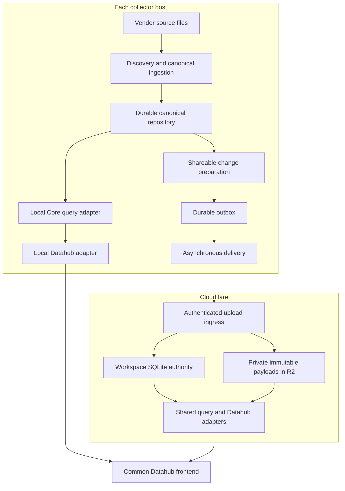

# Architecture and decisions

## Deployment topology

The host ingestion service owns writes to canonical state; local APIs and the
synchronizer consume it through repository interfaces. The service can run
without a browser. CLI one-shot operation can use the same interfaces without
installing a daemon. Supervision restarts an interrupted process; persisted state
provides correctness.

At first, adapt existing stores behind the repository interface rather than
requiring an all-at-once database rewrite. Each operation must state its real
transaction boundary. Converge canonical resources, change journal, and source
checkpoints on one host SQLite database where atomic updates are required.
Outbox persistence can remain separate if the consumed page and its cursor are
committed together there and immutable canonical revisions remain replayable.
Never claim one atomic transaction across two SQLite databases.

## Ownership boundaries

| Layer | Owns | Must not do |
| --- | --- | --- |
| Ingestion | File identity, complete-record offsets, parsing, canonical IDs, measurements | Network publication or UI-specific semantics |
| Canonical repository | Resource versions, topology, source lineage, change journal, indexes | Treat presentation deltas as full canonical evidence |
| Preparation | Shareable projection, stable chunking, immutable pending captures | Persist secrets or raw evidence in remote-bound payloads |
| Delivery | Missing-chunk negotiation, retries, receipts, batching policy | Recompute an attempted batch or silently skip failed work |
| Workspace authority | Ownership, fences, publication revisions, committed manifests, read indexes | Publish incomplete data or run unbounded graph work inside a transaction |
| Query layer | Common contracts, scoped access, revision-pinned reads | Publish data while answering a query |
| Datahub | Presentation, capabilities, freshness, lazy navigation | Recalculate canonical metric formulas independently |

## Storage decisions

Retain the current Cloudflare platform: one SQLite Durable Object per workspace
for transactional metadata and revision coordination; private R2 for immutable
canonical chunks and read projections. Use explicit indexed tables instead of
`State.all()` and whole-workspace filtering for routine lists and change feeds.
The current generic 10,000-record query ceiling is an implementation constraint,
not a retention policy or an acceptable long-running query strategy.

Move payload decoding/validation and R2 I/O outside short metadata transactions.
Persist validation attestations bound to immutable hashes, schema version, and
principal before accepting a manifest. Revalidate authorization and source fences
inside the commit transaction. R2 and SQLite do not share a transaction; upload
before commit, and reference only verified immutable objects.

Cloudflare documents [transactional Durable Object storage](https://developers.cloudflare.com/durable-objects/best-practices/access-durable-objects-storage/)
and [R2 read-after-write consistency](https://developers.cloudflare.com/r2/reference/consistency/).
These support this ordering but do not eliminate application-level commit logic.

Do not add D1, a Queue, or another central Python service just to mirror the same
authority. Start with bounded indexed workspace transactions. Benchmark before
introducing project sharding or a separate analytical read database. Any future
sharding design must specify how cross-project reads obtain a consistent revision;
it cannot retain an implicit global sequence by assumption.

## Canonical construction

A living response is a projection, sometimes containing host paths or inline
content. It is not the canonical replication contract. Reuse discovery fences
and ingestion functions; derive local living views and shareable upload data from
the same canonical revision.

Incremental parsing is adapter-specific. Completed records are parsed only after
a complete source prefix is available. Truncation, rotation, corrected earlier
records, and parser/schema upgrades require a new epoch or reconciliation. Keep
full reconstruction as a bounded correctness oracle and fallback; record when it
is used. Chunk reuse proves reduced transfer, not reduced parser work.

## Scope and policy

Local source is one host's available authority. Shared source is the authorized
workspace's published data from its collector hosts. Keep explicit selection;
existing CLI local-first fallback may remain only under its documented narrow
missing-source conditions. A successful empty local result remains success.

Manual and automatic modes control delivery, not discovery or read behavior.
The existing Mac upload LaunchAgent stays disabled unless explicitly enabled.
Frozen exports remain optional archive artifacts, not the main live read path.
Public website code deployment is independent of data publication.

## Non-goals for this refactor

Raw transcript synchronization, automatic evidence federation, concurrent writers
to the same canonical session without ownership transfer, a metrics engine rewrite,
and cross-workspace analytics are excluded. Estimation contracts remain compatible;
their jobs must not advance the historical publication watermark.
