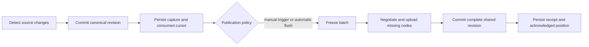

# Synchronization, batching, and recovery

## Service loop

Local ingestion and preparation continue without network access. They share
source inventory/cache facilities with local APIs. A slow network does not hold
canonical database transactions or block page reads. When storage budgets are
exhausted, stop advancing the consumed cursor and report backpressure; never drop
unsent records and claim to be caught up.

## Durable states

`prepared -> ready -> uploading -> awaiting_commit -> acknowledged`.
Transient failures enter `retry_wait` with the previous durable phase retained.
Authorization/schema/ownership conflicts enter `blocked` with a bounded error code
and operator remedy. Superseded unattempted captures may be compacted only when
all required history and tombstone effects remain represented.

A batch freezes identity, content, source vector, and dependency hashes before its
first network attempt. It stays immutable thereafter. Later observations enter a
new batch. Per-source order is preserved; independent sessions can progress when
one lineage is blocked. Global sequence gaps must not silently discard work.

Store both consumed and acknowledged progress. The source/living delta journal
can be replayed after a crash. A captured page is marked consumed only in the
same outbox transaction that retains its payload/references. Remote ACKs are
recorded only after durable publication, not after chunk transfer.

## Coalescing and flush policy

Coalesce replaceable canonical state only before batch freeze. Preserve distinct
items, required event ordering, corrections, tombstones, and graph dependencies.
A session summary can be replaced by its newest state; an append-only evidence
sequence cannot be collapsed into a counter if replay requires its entries.

Proposed configurable starting budgets, to be qualified rather than treated as
platform guarantees: automatic flush after 60 seconds, 256 KiB encoded request
budget, or 200 changed resources; explicit trigger and turn/session completion
also flush. Initial imports use the same limits. A resource larger than a chunk
budget is segmented by its schema; a caller cannot bypass the limit by selecting
one very large resource. A completion flush occurs after a complete source fence,
not on inference from a quiet file.

Manual mode is the default. Proposed CLI lifecycle (names to reconcile with the
candidate implementation): `prepare`, `status`, `publish`, `service`, `pause`, and
`resume`. `prepare` performs no network publication; `publish` submits frozen
selected captures; `service` defaults to preparation unless automatic mode was
explicitly persisted. Restart retains mode. Installation does not enable a host
scheduler implicitly. Existing `collector run` publishes immediately and must not
be relabeled as a dry-run or preview.

## Crash/failure matrix

| Boundary | Recovery |
| --- | --- |
| Before canonical commit | Replay the same complete source prefix |
| After canonical commit, before capture | Replay the canonical change journal |
| During capture transaction | Both payload and cursor roll back, or both persist |
| After capture, before any upload | Drain the saved batch |
| After some nodes uploaded | Negotiate hashes; send missing nodes only |
| After all nodes, before commit | Retry the same manifest/batch |
| After remote commit, before local ACK | Recover/retry identity and receive the existing receipt |
| Source rotation/truncation | New source epoch and fenced reconstruction; no offset guessing |
| Expired/reset local cursor | Bounded snapshot/hash reconciliation; preserve still-pending batches |
| Collector restart/duplicate process | Durable owner locking and lease fencing prevent two writers sharing one sequence |
| Network outage | Exponential backoff with jitter and visible backlog |
| Revoked token/schema conflict | Block the affected stream; retain work and expose remedy |
| Remote state rollback | Detect server incarnation/revision mismatch and reconcile; old ACKs alone are insufficient |

At-least-once attempts plus idempotent commits give duplicate-safe effects. Do not
claim exactly-once network delivery. No Queue is required initially; if introduced,
its consumers must retain the same deduplication contract because Cloudflare
[Queues can redeliver messages](https://developers.cloudflare.com/queues/reference/delivery-guarantees/).

## Liveness and operational reporting

Keep observed session state, collector connectivity, and publication freshness
separate. Heartbeat expiry means current liveness is unknown. Recovery must not
replay an old terminal observation as fresh merely because it was uploaded now.
Use source observation time, server receipt time, and bounded lease expiry for
their distinct purposes. Manual publication does not silently send heartbeats;
an independent automatic presence policy requires explicit configuration.

Report pending count/bytes, oldest pending age, last consumed and acknowledged
positions, last successful publish time, batch attempts, blocked reason codes,
and chunk reuse/transfer totals. Remote views show host-reported backlog only
while that report is fresh; an offline host's current backlog is unknown.

Retention is reference-based: retain everything needed by pending captures,
active cursors, visible revisions, and rollback windows. Stage abandonment and
old revision cleanup use mark/recheck/delete with a grace period and a recorded
minimum readable revision. No broad R2 lifecycle deletion of referenced chunks.
Actual retention/disk limits are configuration; destructive cleanup remains
inactive until its rollback/reference-race qualification passes.
