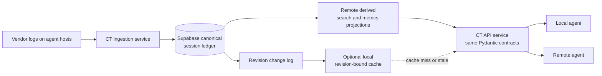

# Remote Session Ledger Design

- **Status:** Proposed
- **Date:** 2026-09-02
- **Scope:** CodingTrajectory session storage, API custody, and agent caches

## Decision summary

CodingTrajectory will move from a local-source / local-cache architecture to a
remote-first architecture:

1. **Supabase is the single operational source of truth for accepted CT session
   artifacts.** It owns canonical session graph revisions, their change log,
   and the shared analytical projections derived from them.
2. **Every local database is a cache.** A local agent may retain a private,
   revision-bound SQLite cache for latency or offline work, but it cannot become
   an alternate write authority or silently answer as if it were current.
3. **The existing CT API contracts remain the common read interface.** Local
   and remote agents call the same `project.*`, `session.*`, and `graph.*`
   methods against a repository backed by the remote ledger.
4. **Vendor logs become upstream ingestion evidence.** They remain useful for
   recovery and audit on their originating machine, but once a CT artifact is
   accepted remotely they are not the query authority for shared work.

This is a target architecture. The current implementation remains local JSONL
discovery plus a rebuildable SQLite projection until the remote ledger is
implemented and migration evidence proves the new boundary.

## Why the current cache must not be synchronized

The current Datahub `IncrementalStore` is deliberately a local SQLite read
model over immutable vendor JSONL. It contains source checkpoints, source paths,
normalized source messages, derived entity records, and a bounded change log.
Those records are valuable implementation details, but they are not a portable
canonical artifact format.

Copying the SQLite file between machines would create two risks:

- a cache schema or host-local path would become an accidental shared contract;
- two caches could each claim to be the latest truth after independent refreshes.

Instead, the remote ledger stores the *logical canonical records* that the cache
currently helps serve. The server then owns any shared materialized views.
Local caches may reproduce those views from a remote revision, but they do not
sync with each other and do not write session truth back to the server.

## Terms and custody

| Term | Meaning | Authority |
|---|---|---|
| Vendor source | A Codex, Claude, or Pi local log used as an ingestion input. | Upstream evidence only after acceptance. |
| CT artifact | One canonical `SessionGraph` and its sessions, turns, events, items, and edges. | Remote ledger after acceptance. |
| Artifact revision | An immutable, hashed snapshot of a CT artifact. | Remote ledger. |
| Projection | Search, overview, metrics, or Datahub read model derived from a revision. | Rebuildable; remote-derived state is shared. |
| Agent cache | A local copy of remote projection data keyed by a remote revision. | Never authoritative. |
| Ingestion receipt | Evidence that a source observation was accepted, deduplicated, or rejected. | Remote ledger. |

The original vendor log is not deleted by this design. It remains the evidence
available to the originating host. It is not, however, a fallback read source
for a shared API request: a remote query either has an accepted revision or is
honestly unavailable.

## Target topology



The diagram intentionally has no cache-to-cache arrows and no cache-to-ledger
write arrow. The only path that creates or updates canonical artifacts is the
ingestion service.

## Canonical remote artifact model

### Publication unit

The publication unit is one complete `SessionGraph`, rooted at its existing
canonical `root_session_id`. A graph is the right unit because CT records
parent/child sessions, ordinary forks, subagents, and observed edges as one
connected orchestration artifact. Publishing independent JSONL files would
break those relationships.

The initial slice publishes **completed graphs only**. That avoids two hosts
racing to publish different partial observations of the same growing log. Live
publication is a later protocol with source watermarks and heartbeats; it is
not inferred from an absent update.

### Authoritative tables

The first schema should store a complete canonical graph revision as a validated
JSONB document. This keeps the remote canonical representation aligned with the
existing Pydantic `SessionGraph` model and preserves all current historical API
semantics before a broad relational rewrite.

```text
ct_artifacts
  artifact_id uuid primary key                 -- root_session_id
  workspace_id uuid not null
  current_revision bigint not null
  state enum(accepting, complete, tombstoned)
  created_at, updated_at

ct_artifact_revisions
  artifact_id uuid
  revision bigint
  schema_version text                          -- canonical model contract
  payload jsonb                                -- complete SessionGraph
  content_sha256 text
  observed_at timestamptz
  accepted_at timestamptz
  primary key (artifact_id, revision)

ct_ingest_sources
  source_id uuid primary key
  workspace_id uuid
  origin_agent_id uuid
  vendor text
  native_session_id text
  source_fingerprint text
  observed_until timestamptz
  artifact_id uuid

ct_ingest_receipts
  receipt_id uuid primary key
  source_id uuid
  source_fingerprint text
  artifact_id uuid
  artifact_revision bigint
  outcome enum(accepted, duplicate, rejected)
  reason text
  accepted_at timestamptz

ct_change_log
  workspace_id uuid
  sequence bigint
  artifact_id uuid
  artifact_revision bigint
  kind enum(published, superseded, tombstoned)
  committed_at timestamptz
```

`ct_artifact_revisions.payload` is the canonical CT data representation. Search
indexes, session cards, metric facts, and future normalized query tables are
derived projections. They may be rebuilt from a revision and must never contain
the only copy of a canonical field.

The server may later extract stable, high-volume fields into normalized tables
for query performance. That optimization must preserve a single declared
canonical representation and a deterministic reconstruction path; it must not
create a second writable session model.

### Identity and revisions

- Existing canonical UUIDs stay stable. Agents can therefore cite the same
  graph, session, turn, item, and event identifiers locally and remotely.
- `artifact_id` is the graph root UUID. It is namespaced by `workspace_id` at
  every database boundary.
- A new accepted content fingerprint creates `revision + 1`; an identical
  fingerprint produces a `duplicate` receipt and no new revision.
- No accepted revision is overwritten. `current_revision` is a pointer, not a
  mutable replacement payload.
- A tombstone advances the change sequence and tells every cache to evict the
  artifact. It is distinct from revoking one reader's access grant.

## Ingestion protocol

### One logical writer

Many agent hosts may discover source logs, but they do not receive direct table
write access. Each host calls one authenticated CT ingestion endpoint. That
endpoint is the logical writer: it validates the canonical contract, resolves
idempotency, and commits canonical rows plus derived remote projections in one
database transaction.

```text
discover source → assemble SessionGraph → validate → hash → ingest request
                                                        ↓
        one transaction: source receipt + revision + current pointer
                         + projections + change-log sequence
```

The publisher supplies an origin identity, vendor identity, stable native source
identity, source fingerprint, observed timestamp, and canonical graph payload.
It does not submit a local SQLite database or host-local cache rows.

### Conflict rules

For the first completed-graph slice:

1. A graph with the same fingerprint is idempotent.
2. A later complete graph with a new fingerprint appends a revision.
3. A competing observation that claims the same artifact but lacks a later
   source watermark is rejected or recorded as a non-authoritative duplicate;
   it cannot overwrite the accepted revision.
4. A malformed graph is rejected with a durable receipt and leaves the prior
   accepted revision intact.

Streaming a live session requires more than a whole-graph hash. It must model
append offsets, source-segment replacement, compaction boundaries, and
out-of-order delivery. That work is intentionally deferred until historical
artifact parity is proven.

## Read APIs and repository seam

### Contract preservation

CT's Python/Pydantic contracts remain the API authority. Reimplementing current
graph, usage, and evidence semantics independently in SQL or Edge Function
TypeScript would create a second interpretation of the same artifacts.

Introduce an `ArtifactRepository` port behind the current service runtime:

```text
ServiceRuntime / existing method contracts
                 │
                 ▼
          ArtifactRepository
          ├── RemoteLedgerRepository  → Supabase artifact revisions
          └── LocalCacheRepository    → optional revision-bound SQLite cache
```

`RemoteLedgerRepository` reconstructs a `DocumentStore` from one or more
remote canonical revisions, then invokes the existing service handlers. The
initial remote API service is therefore Python, alongside the canonical CT
models. Supabase supplies PostgreSQL, Auth, RLS, durable storage, and change
notifications; it does not become a duplicate semantic implementation.

All historical method families target response parity:

- `project.list` and `project.sessions`
- `session.summary`, `session.search`, `session.items`, and `session.events`
- `session.overview`, `session.stats`, and all usage methods
- `session.tree`, `graph.overview`, `graph.stats`, and `graph.usage`

Search snippets, metrics, and summaries retain their existing rule: they are
derived projections with canonical IDs as evidence references, never new
canonical facts.

### Query source selection

The CLI and agent integration need an explicit source selector:

```text
ct api call session.summary --source remote ...
ct api call session.summary --source cache ...
```

`remote` is the default for normal operation. `cache` is permitted only when it
can identify the exact remote `workspace_id`, change sequence, artifact
revision, and projection version it represents. If the cache cannot prove it is
current, the response reports itself as stale or fetches remotely. It never
falls back to a local vendor log for a supposedly remote query.

There is deliberately no implicit `local + remote` merge mode. A merge can hide
which revision an agent actually read and recreate split-brain behavior.

### Live-state exception

Historical artifact APIs can share the same contract and evidence. Connected
runtime liveness is different: an agent process or app-server is authoritative
only while it is connected to that host. A remote database may report the last
ingested liveness observation and its timestamp, but cannot infer that a host
is idle or disconnected merely because no new row arrived.

`living.sessions` and `living.events` therefore require an additive remote
protocol version with source heartbeat and freshness fields. Remote absence is
`unknown`, not `not_living`. This preserves CT's existing distinction between
cross-process discovery and connected-runtime authority.

## Caches and centralized projections

### Remote projections

The current local Datahub concepts move to the remote database as derived,
transactionally maintained projections. Examples include searchable text
indexes, session/graph overview cards, metrics facts, and a revision change
log. They are built from `ct_artifact_revisions` in the same accepted-ingest
transaction or rebuilt from its immutable contents.

### Agent-local caches

An agent-local cache is allowed for speed. Every cache record carries at least:

```text
workspace_id
artifact_id
artifact_revision
remote_change_sequence
projection_name
projection_version
cached_at
```

A cache invalidation is a wake-up signal. The client fetches the authoritative
change record or artifact revision from Supabase; it does not accept a cache
peer's claim. Cache eviction and rebuild are safe because the remote ledger
retains the canonical revision.

## Access control

The remote database is shared custody, so access is part of the canonical
design rather than an afterthought.

```text
ct_workspaces
ct_workspace_members
ct_artifact_grants
  workspace_id, artifact_id, principal_id, content_scope, expires_at, revoked_at
```

- Every canonical and projection table enables Row Level Security.
- A remote agent authenticates as a Supabase Auth principal, not with the
  database password and not with a service-role key.
- The ingestion service has a narrowly scoped write role. Agent principals have
  no direct canonical-table write permission.
- The CT API service must propagate the caller's identity to the database or
  enforce the equivalent grant check before loading an artifact; a shared
  service credential may not become a read bypass.
- `content_scope` starts as `metadata` or `full_canonical`. More restrictive
  redacted scopes can be added without inventing a second artifact store.

The initial implementation should treat access revocation honestly: it blocks
future database reads and triggers cache eviction, but cannot retract content
that an agent already received.

## Migration plan

### Phase 0 — contract and migration evidence

1. Freeze the remote artifact schema version and the canonical serialization
   format.
2. Define an ingestion request/receipt contract and source fingerprint rules.
3. Choose workspace and agent-principal identity mapping.
4. Produce fixtures that demonstrate Pydantic round-trip, deterministic hash,
   and API response parity for one completed graph.

### Phase 1 — remote completed-graph ledger

1. Add Supabase migrations for authoritative artifact, revision, receipt, and
   change-log tables plus RLS policies.
2. Implement a Python remote repository and the authenticated ingestion
   endpoint.
3. Ingest one completed graph idempotently.
4. Serve `session.summary`, `session.search`, and `graph.overview` remotely
   from the accepted revision.
5. Record the remote revision/hash in the local ingestion receipt.

### Phase 2 — historical API parity

1. Move the remaining historical `session.*`, `graph.*`, and `project.*`
   methods to `RemoteLedgerRepository`.
2. Add centralized remote search and metrics projections only after parity
   baselines identify the necessary indexes.
3. Make `--source remote` the standard CLI/agent mode.

### Phase 3 — optional local caches

1. Add pull-through cache records keyed by remote revision and projection
   version.
2. Consume the remote change log for invalidation.
3. Demonstrate stale/offline labels and recovery without any cache write-back.

### Phase 4 — live publication

1. Define source watermark and heartbeat contracts.
2. Version the remote living APIs with freshness and provenance fields.
3. Prove that remote state never overclaims connected app-server liveness.

## Acceptance evidence

The architecture is ready to promote only when all of the following are true:

1. An accepted remote revision round-trips through the canonical Pydantic model
   with the same content hash.
2. A selected completed graph produces equivalent bounded historical API
   responses from local assembly and the remote repository.
3. Repeating the same ingest creates no new revision; a changed source creates
   exactly one ordered revision and change-log entry.
4. A cache miss, stale cache, and cache eviction all fetch the remote revision
   rather than using a local vendor log as hidden authority.
5. RLS denies a non-member agent and permits only the granted content scope.
6. A rejected or malformed ingest leaves the prior remote revision queryable
   and records an actionable receipt.
7. Remote liveness answers include observation freshness and never claim local
   connected-runtime state without a live source authority.

## Open decisions

These choices are required before implementation, but do not alter the settled
single-source-of-truth boundary:

1. **Workspace model:** one owner workspace first, or organization/team
   workspaces from the initial migration.
2. **Canonical content access:** whether every workspace member receives
   `full_canonical`, or individual artifact grants are required by default.
3. **Retention:** remote retention period, export policy, and tombstone versus
   physical-deletion policy.
4. **Remote CT API deployment:** the hosting target for the Python service that
   preserves the existing Pydantic contracts.
5. **Live protocol:** freshness window and whether active-session publication is
   needed after completed-graph parity is complete.

## Explicit non-goals

- Synchronizing or uploading SQLite database files.
- Letting caches write to one another or to the remote canonical tables.
- Recreating CT graph, metric, or evidence semantics in a second TypeScript or
  SQL implementation.
- Treating a remote lack of updates as proof that a local agent is not living.
- Automatically merging local vendor logs with a remote artifact revision in
  one unlabelled API response.
